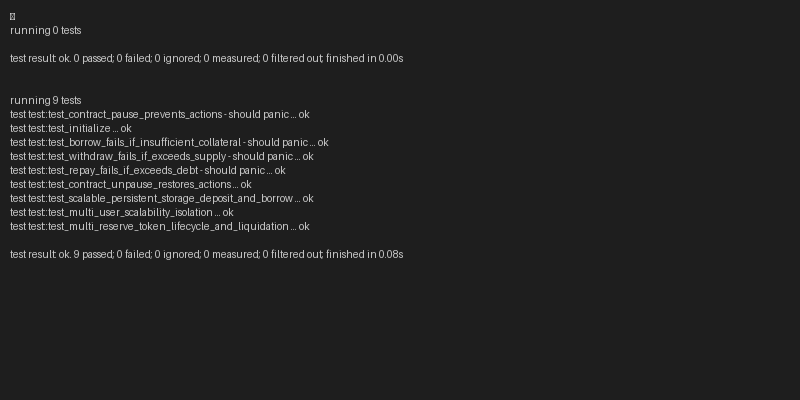

# 🚀 StellarLend — Scalable Next-Gen P2P DeFi Lending Protocol
[](https://github.com/ashishh-tech/Stellar-Peer-to-Peer-Lending/actions/workflows/ci.yml)
[](https://soroban.stellar.org)
[](https://soroban.stellar.org/docs/fundamentals-and-concepts/state-archival)
[](https://github.com/ashishh-tech/STELLARLEND)

## 📌 Project Overview

**StellarLend** is a decentralized, non-custodial Peer-to-Peer (P2P) lending and borrowing protocol built on the **Stellar blockchain** using **Soroban smart contracts (Rust)**. It allows users to supply collateral, earn dynamic algorithmic yield, and borrow digital assets with zero intermediaries, high capital efficiency, and sub-second settlement.

---

## ⚡ Architectural Upgrades (Scalability & Resilience)

### 1. 🏗️ **Infinite Multi-User Scale via Persistent Storage**
* **The Problem with Instance Storage**: Contracts storing user balances in `instance()` storage load all user records on every invocation, quickly exceeding Soroban single-ledger entry limits (64KB) and breaking protocol scaling.
* **The StellarLend Solution**: Transitioned user accounts to **isolated `persistent()` storage entries** (`DataKey::UserPosition(Address, Address)` and `DataKey::UserAccount(Address)`) with **automatic TTL extension** (`extend_ttl`). Each user position lives in its own dedicated ledger entry, enabling the protocol to scale to millions of concurrent accounts without storage bottleneck.

### 2. 📊 **Algorithmic Kink Interest Rate Model**
* Dynamic interest rate determination based on capital utilization ($U = \frac{\text{Borrowed}}{\text{Supplied}}$):
  $$\text{Borrow Rate} = \text{Base Rate} + \left(U \times \text{Slope Rate}\right)$$
  $$\text{Supply Rate} = \text{Borrow Rate} \times U \times (1 - \text{Reserve Factor})$$
* Compounding interest indices (`supply_index`, `borrow_index`) accrued on every state transition.

### 3. 🛡️ **Automated Liquidation Engine & Keeper Bounties**
* **Solvency Protection**: Real-time on-chain Health Factor calculation:
  $$\text{Health Factor} = \frac{\sum (\text{Collateral}_i \times \text{Price}_i \times \text{Threshold}_i)}{\sum (\text{Debt}_j \times \text{Price}_j)}$$
* **5.0% Keeper Bounty**: When a borrower's Health Factor drops below 1.0, any community liquidator can repay the debt via `liquidate()` and seize collateral with an instant **5.0% liquidation premium**, preventing bad debt.

### 4. 🌐 **Multi-Reserve Token Ecosystem**
* Native support for SEP-41 / SAC tokens:
  * **XLM** (Stellar Lumens) — 75% LTV, 80% Liquidation Threshold
  * **USDC** (USD Coin) — 85% LTV, 90% Liquidation Threshold
  * **EURC** (Euro Coin) — 80% LTV, 85% Liquidation Threshold
  * **WBTC** (Wrapped Bitcoin) — 70% LTV, 75% Liquidation Threshold

---

## ✨ Full Feature Suite

* 🔗 **Scalable Soroban Smart Contracts** with isolated persistent storage and automatic TTL management.
* 👛 **Freighter Wallet Integration** with one-click connection and transaction signing.
* 📈 **Interactive Health Factor SVG Gauge** with dynamic safety zones (Safe, Moderate, Warning, Liquidation).
* 🏪 **Multi-Asset Lending Markets** table with real-time APYs, pool depths, and utilization bars.
* ⚡ **Liquidation Terminal & Auction Hub** with live borrower risk matrix and 1-click keeper execution.
* 🧮 **Interactive Yield & Stress Simulator** with compound APY sliders and price volatility crash modeling.
* 📊 **Protocol Analytics Terminal** with dynamic interest rate kink curves and reserve breakdowns.
* 💧 **Instant Testnet Faucet & Quick Funding** modal for rapid review testing.
* 🚀 **Interactive Beginner's Onboarding Guide & Activation Checklist**.
* 🎁 **Growth & Referral Engine** with tiered APY incentives.
* 💬 **Continuous Product Feedback Widget** for community-driven iteration.

---

## 🛠️ Tech Stack

* **Smart Contracts**: Rust, Soroban SDK v25 (`#![no_std]`)
* **Blockchain**: Stellar Network (Testnet & Mainnet Ready)
* **Frontend**: Next.js 16 (App Router), React 19, Tailwind CSS
* **Wallet & SDK**: `@stellar/freighter-api`, `stellar-sdk`
* **Styling**: Glassmorphism, Cyberpunk DeFi Gradients, Dynamic Glow Mesh Orbs

---

## 🌐 Deployed Smart Contract (Testnet)

* **Contract ID**: `CD4M6SRU32V6UPBXLWYI6HU74RJUYTJFOCX5AFR56LF5IXLDSZSM2TYS`
* **Stellar Expert Explorer**: [View on Stellar Expert](https://stellar.expert/explorer/testnet/contract/CD4M6SRU32V6UPBXLWYI6HU74RJUYTJFOCX5AFR56LF5IXLDSZSM2TYS)
* **Live Application**: [STELLARLEND Live Demo](https://stellarlendmastery-demo.netlify.app)
* **Demo Video**: [StellarLend Video Walkthrough](https://youtu.be/OrPAJ9Ojqe0)

---

## 🧪 Smart Contract Verification (Passing Tests)

Run the comprehensive unit test suite:
```bash
cargo test
```

### Test Coverage Highlights (9/9 Passed):
```
running 9 tests
test test::test_initialize ... ok
test test::test_borrow_fails_if_insufficient_collateral - should panic ... ok
test test::test_contract_pause_prevents_actions - should panic ... ok
test test::test_withdraw_fails_if_exceeds_supply - should panic ... ok
test test::test_repay_fails_if_exceeds_debt - should panic ... ok
test test::test_contract_unpause_restores_actions ... ok
test test::test_scalable_persistent_storage_deposit_and_borrow ... ok
test test::test_multi_user_scalability_isolation ... ok
test test::test_multi_reserve_token_lifecycle_and_liquidation ... ok

test result: ok. 9 passed; 0 failed; 0 ignored; 0 measured; 0 filtered out; finished in 0.08s
```



---

## 🚀 How to Run Locally

### 1. Smart Contract:
```bash
# Clone the repository
git clone https://github.com/ashishh-tech/STELLARLEND.git
cd STELLARLEND

# Run tests
cargo test

# Build WASM binary
cargo build --target wasm32-unknown-unknown --release
```

### 2. Frontend Application:
```bash
cd frontend

# Install dependencies
npm install

# Run development server
npm run dev
```
Open `http://localhost:3000` in your browser.

---

## 📄 License
MIT License. Built for the Stellar Soroban Ecosystem.
